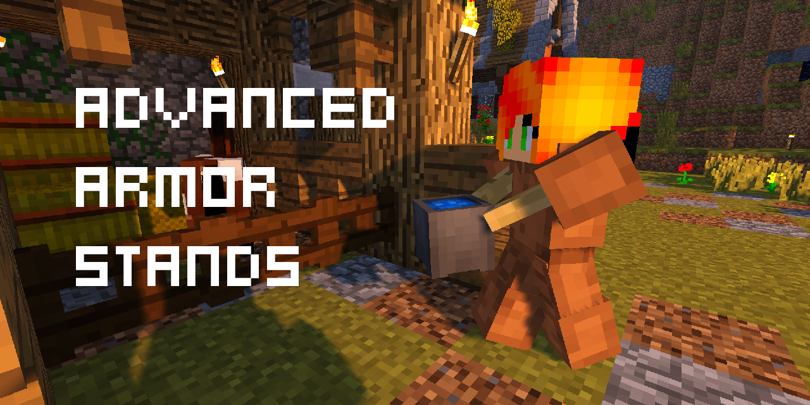
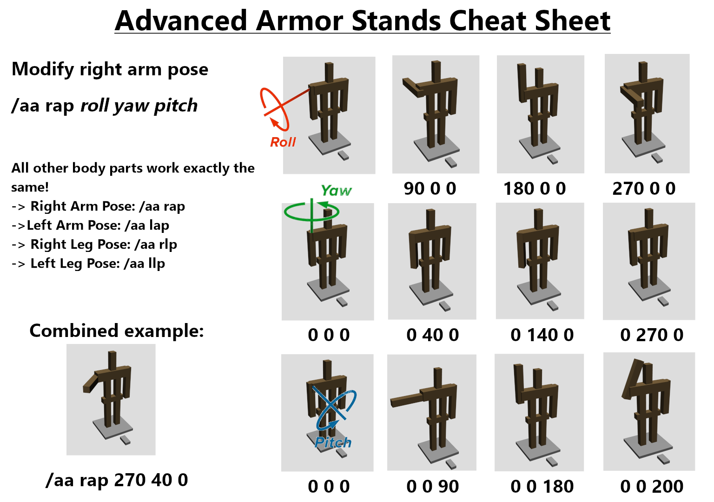

# Advanced Armor Stands

This is a plugin for CraftBukkit/ Spigot. Download from [https://www.spigotmc.org/resources/advanced-armor-stands.38513/](https://www.spigotmc.org/resources/advanced-armor-stands.38513/)

### Contents
- [Overview and Features](#overview)
- [Depencies](#depencies)
- [Commands and Permissions](#commands)
- [Config](#config)
- [Languages](#language)

# Overview

Access all the hidden vanilla armor stands options with an easy menu. Perfect for decoration on survival servers and builders!

### Features

- Enable arms, invisible baseplates, no gravity and much more for your armorstand.
- Arange all body parts in a fancy pose you want. Or choose one of the various preset poses!
- Colorable names! 
- Invisible armor stands! Perfect for floating letters or items!
- Player heads! Get the head of every player you want and place it on your armor stand (this feature can be fully disabled!)!
- Invulnerable armor stands! Save from accidental punches!

### How to use?

Just stand next to the armor stand you want to modify and type the command `/aa` in chat! A menu will pop up with all available options!

# Dependencies

This plugin was made for Spigot v.1.17.x.

# Commands and Permissions

### Pose command cheat sheet

### Commands overview

- Overview over all commands available in this plugin. All permissions are set to `true` by default.
- If you want to disable access to player heads in both menu and per command, set the permission `aa.head` to `false`.

| Command                                            | Permission | Description                      |
| -------------------------------------------------- |:----------:|:--------------------------------:|
| /aa                                                |  aa.edit   | Opens the Menu. Some functions inside the menu depend on other permission nodes.|
| /aa help \<page-number>                            |  aa.edit   | Shows the help page |
| /aa info                                           |  NONE      | Shows general info about this plugin (version number, etc). |
| /aa arms \<on/off> \<range>                        |  aa.edit   | Use "on" to give all armor stands arms. Use "off" to remove arms of all armor stands. \<range> defines the range around the player in which armor stands are affected. |
| /aa base \<on/off> \<range>                        |  aa.edit   | Use "on" to give all armor stands a baseplate. Use "off" to remove the baseplate of all armor stands. \<range> defines the range around the player in which armor stands are affected. |
| /aa gravity \<on/off> \<range>                     |  aa.edit   | Use "on" to give all armor stands gravity. Use "off" to remove gravity from all armor stands. \<range> defines the range around the player in which armor stands are affected. |
| /aa size \<normal/small> \<range>                  |  aa.edit   | Use "normal" to make all armor stands normal sized. Use "small" to make all armor stands smalls. \<range> defines the range around the player in which armor stands are affected. |  
| /aa glow \<on/off> \<range>                        |  aa.edit   | Use "on" to make all armor stands glow. Use "off" to remove the glow effect. \<range> defines the range around the player in which armor stands are affected. |
| /aa invulnerable \<on/off> \<range>                |  aa.edit   | Makes armor stands unbreakable/ breakable. Note: Players in creative mode can always destroy an armor stand. |
| /aa hp \<roll> \<jaw> \<pitch> \<range>            |  aa.edit   | Adjusts the head pose of all armor stands in a radius of <range> blocks around the player. |
| /aa bp \<roll> \<jaw> \<pitch> \<range>            |  aa.edit   | Adjusts the body pose of all armor stands in a radius of <range> blocks around the player. |
| /aa rap \<roll> \<jaw> \<pitch> \<range>           |  aa.edit   | Adjusts the right arm pose of all armor stands in a radius of \<range> blocks around the player. |
| /aa lap \<roll> \<jaw> \<pitch> \<range>           |  aa.edit   | Adjusts the left arm pose of all armor stands in a radius of \<range> blocks around the player. | 
| /aa rlp \<roll> \<jaw> \<pitch> \<range>           |  aa.edit   | Adjusts the right leg pose of all armor stands in a radius of \<range> blocks around the player. |
| /aa llp \<roll> \<jaw> \<pitch> \<range>           |  aa.edit   | Adjusts the left leg pose of all armor stands in a radius of \<range> blocks around the player. |
| /aa stats                                          |  aa.edit   | Shows all angles of a nearby armor stand |
| /aa visible \<on/off> \<range>                     |  aa.visible   | Use "on" to make all armor stands visible. Use "off" to make all armor stands invisible. \<range> defines the range around the player in which armor stands are affected. |
| /aa name \<name>                                   |  aa.names  | Gives all armor stands in 1 block range a colorable name. Supports all default game color codes. |
| /aa hidenames \<range>                             |  aa.names  | Removes names from all armor stands in a radius of \<range> blocks around the player. |
| /aa tp \<x> \<y> \<z>                              |  aa.tp     | Teleports a nearby armor stand to the coords \<x> \<y> \<z>. The coords are the exact coords. To teleport a armor stand in the middle of a block use x.5 and z.5. | 
| /aa clone \<x> \<y> \<z>                           |  aa.clone  | Duplicates a nearby armor stand to the coords \<x> \<y> \<z>. It copies all settings but names, visibility or equipment. In creative mode equipment will be copied. |
| /aa head \<player-name> \<amount>                  |  aa.head   | Gives the head of a player. Use \<player-name> for the player name and \<amount> for the amount of heads you want.|
| /aa give \<amount>                                 |  NONE      | Adds an armor stand to your inventory. Player needs creative mode to use this. | 

# Config

The config.yml-file contains configuration options for the plugin. To apply any changes, save the file and reload or restart your server.

| Config-Path   | Default value | Description                                                                 |
| ------------- | ------------- | --------------------------------------------------------------------------- |
| spawnWithArms | true          | Defines wheather new armor stands spawn with arms already turned on or not. |
| ------------- | ------------- | --------------------------------------------------------------------------- |
| maxDistance   | 100           | Defines the max range that can be set.                                      |

# Languages

AdvancedArmorStands can support multiple languages simultaneously. The language used is the language the user has set in his game settings. If that language is not available, english is the default option.

### Add custom languages

- To add a new language, navigate to the file `AdvancedArmorStands/ressources/lang.yml` in your servers plugin folder. Copy the section "default" and paste it to the bottom of the file. Replace the string "en_us" in your pasted section with your desired language string. After that replace all the english sentences with your own language.
- If you want to add a new language, consider sending it in to be added to the plugin. That way all players can benefit from it.

### Color codes in the language file

- To change the visual color of a sentence, you can use the default game color codes. But note, that you have to use a `§` instead of the `&` you might be used to.
